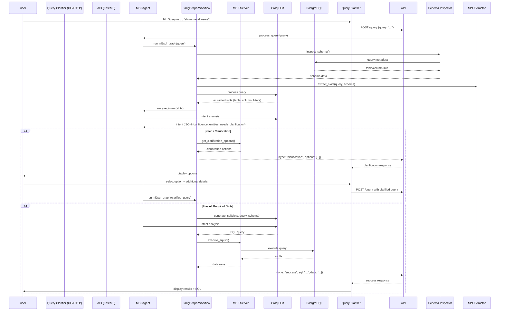

# Application Flow Documentation

## Overview

The Natural Language to SQL system converts user queries in plain English into executable SQL queries. The system uses an intelligent agent-based architecture with multi-stage processing, clarification loops, and database schema awareness.

---

## Data Flow Architecture

### Detailed Flow Explanation

- **Entry Point**: Users can submit queries via the CLI client ([query_clarifier.py](query_clarifier.py)) or directly via HTTP POST to `/query`.
- **Query Reception**: [api/main.py](api/main.py) receives the query and creates an [MCPAgent](agent/mcp_agent.py) instance.
- **Slot Extraction**: The agent initiates a LangGraph workflow in [agent/nl2sql_graph.py](agent/nl2sql_graph.py). The first nodes analyze the query and extract structured slots.
- **Schema Context**: [core/schema_inspector.py](core/schema_inspector.py) fetches database metadata to resolve table/column references.
- **Intent Analysis**: The LLM (Groq's Llama 3.3 70B) analyzes the query's intent, checking if the request is clear and complete.
- **Clarification Branch**: If slots are missing or intent is unclear, the workflow generates clarification options (multi-choice). The user selects an option via the CLI, and the query is reprocessed with added context.
- **SQL Generation**: Once all slots are present and intent is clear, the LLM generates the SQL query.
- **Execution**: The query is executed against the database via the MCP server tools.
- **Result Delivery**: Results (data rows + generated SQL) are returned to the user through the API response.

---

## Component Interactions

### Component Responsibilities

- **Query Clarifier** ([query_clarifier.py](query_clarifier.py)): Interactive CLI client that handles the clarification loop with the user.
- **API** ([api/main.py](api/main.py)): Single REST endpoint (`POST /query`) that coordinates the MCP agent and returns structured JSON responses.
- **MCPAgent** ([agent/mcp_agent.py](agent/mcp_agent.py)): Core orchestration agent. Connects to the MCP server, performs intent analysis using Groq LLM, and manages the LangGraph workflow.
- **LangGraph Workflow** ([agent/nl2sql_graph.py](agent/nl2sql_graph.py)): State machine that orchestrates the pipeline stages (schema fetch → slot extraction → intent analysis → clarification → SQL generation → execution).
- **Slot Extractor** ([agent/slot_extractor.py](agent/slot_extractor.py)): Parses natural language queries into structured slots (tables, columns, filters, aggregations).
- **Clarification Engine** ([agent/clarification_engine.py](agent/clarification_engine.py)): Generates clarification prompts and options when queries are ambiguous.
- **Schema Inspector** ([core/schema_inspector.py](core/schema_inspector.py)): Inspects database schema to discover available tables and columns.
- **MCP Server** ([mcp_server/server.py](mcp_server/server.py)): Local server that exposes database schema and query execution as MCP tools.

---

## API Endpoints

### POST /query

**Description:** Main endpoint for NL to SQL conversion. Accepts natural language queries and returns structured responses.

**Request:** `QueryRequest { query: str }`

**Response:** `QueryResponse { type: str, sql: str, data: list, messages: list, options: list, row_count: int, slot_analysis: dict, intent_analysis: dict, clarification_context: dict }`

**Response Types:**
- `success`: SQL was generated and executed successfully.
- `clarification`: Need more information from the user.
- `error`: An error occurred during processing.
- `cancelled`: User cancelled the clarification loop.

---

## Key Processing Steps

### 0. Early Query Validation (NEW)

The first step in the LangGraph workflow validates the query for minimum meaningful content. If the query has fewer than 2 words or fewer than 4 characters, it is immediately rejected with a clarification response — **no schema is fetched, no LLM is called**. This saves resources for overly vague queries like "show", "hi", etc.

### 1. Query Reception

The API receives a natural language query and creates an MCPAgent instance. The agent connects to the MCP server if not already connected.

### 2. Schema Discovery

The system inspects the database to understand available tables and columns. Schema filtering can be enabled to limit the scope to relevant tables.

### 3. Slot Extraction

The query is analyzed to extract structured slots:
- `table`: Target database table
- `column`: Columns to query
- `filter`: Filter conditions
- `aggregation`: Aggregate functions (COUNT, SUM, etc.)

### 4. Intent Analysis

The LLM analyzes the query's intent, determining:
- **confidence**: How clear the intent is (0-1)
- **entities**: Key entities in the query
- **is_multi_intent**: Whether the query has multiple intents
- **needs_clarification**: Whether more information is needed
- **rewritten_query**: Clarified query if applicable

### 5. Clarification (if needed)

If slots are missing or intent is unclear:
- The system generates clarification options
- User selects an option and provides additional details
- The query is reprocessed with the new context
- This loop continues until all required information is gathered

### 6. SQL Generation

Once all slots are present and intent is clear, the LLM generates the SQL query.

### 7. Query Execution

The generated SQL is executed against the database, and results are returned.

---

## Important Notes for Updates

- **New Features:** Add a new section documenting the feature's flow, affected components, and any changes to existing behavior.
- **Changes to Flow:** If the flow architecture changes, update the diagram and explanation.
- **API Changes:** If new endpoints are added or existing ones modified, update the API Endpoints section.
- **Component Changes:** If new components are added or existing ones modified, update the Component Interactions section.
